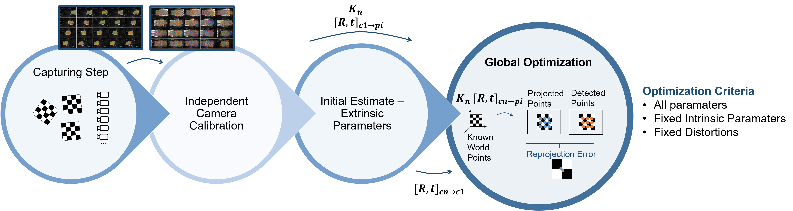

# Photogrammetric Multi-Camera Calibration Toolbox V1
# 1. Introduction 

We implement a generalization of Zhang's widely used single camera calibration algorithm to N cameras. Solutions are found through the overall optimization of the cameras' parameters. The user can choose which subset of cameras' parameters to re-optimize: re-optimize all parameters, fixed intrinsic parameters or fixed lens distortions.

Note: This version of the toolbox can only handle camera configurations with significantly overlapping fields of view. All cameras must be able to observe the entire calibration target simultaneously. 

# 2.1 Calibration Object
The toolbox expects the calibration object to be a standard planar checkerboard pattern.
The checkerboard pattern should be asymmetric and of even and odd dimensions. Example: 28 X 17 corners.

# 2.2 Calibration Image Capture
Capture as many images as necessary to satisfy the following conditions:
- Each camera sees at least 3 fully visible pattern positions.
- Account for as much of each camera’s image frames as possible.
- In 10 to 20 pattern positions the checkerboard is fully visible by all cameras.
- In each image, the checkerboard pattern must be at different orientations relative to the camera.
- The checkerboard should preferably fill at least 20% of the image frame.
- The checkerboard must be at an angle of less than 45 degrees relative to the camera plane.

## 2.3 Image Naming Convension
PositionXXX_CameraXX.

## 2. Dependencies
The implementation depends on the image processing, camera calibration and optimization toolboxes of Matlab.

## 3. How to Cite?
Cite this page.

## 3. How to Use?
Run script main.m.

## Contact

Laura Ribeiro

Tampere University, Finland

laura.goncalvesribeiro@tuni.fi
